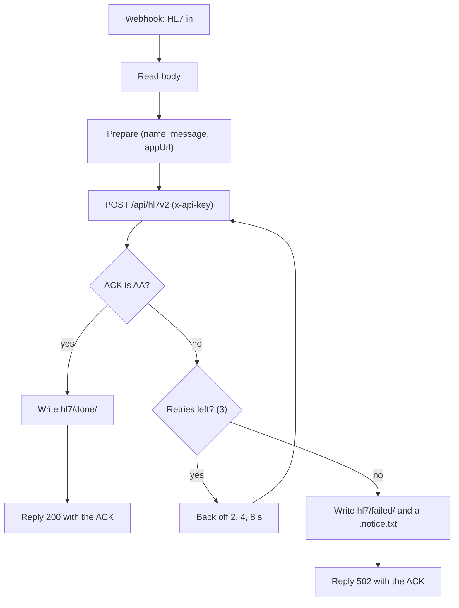
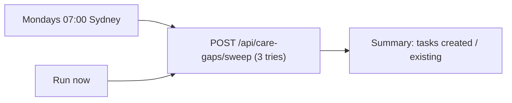

# n8n workflow diagrams

## Pathology inbox

```mermaid
flowchart TD
  H["Webhook: HL7 in"] --> R["Read body"] --> P["Prepare (name, message, appUrl)"]
  P --> S["POST /api/hl7v2 (x-api-key)"]
  S --> Q{"ACK is AA?"}
  Q -- yes --> D["Write hl7/done/"] --> A["Reply 200 with the ACK"]
  Q -- no --> T{"Retries left? (3)"}
  T -- yes --> W["Back off 2, 4, 8 s"] --> S
  T -- no --> F["Write hl7/failed/ and a .notice.txt"] --> X["Reply 502 with the ACK"]
```

## Weekly care-gap sweep

```mermaid
flowchart LR
  M["Mondays 07:00 Sydney"] --> S["POST /api/care-gaps/sweep (3 tries)"]
  N["Run now"] --> S
  S --> U["Summary: tasks created / existing"]
```

Any failure in either workflow runs **ClinIQ error notice**, which writes `notices/error-<time>.txt`.
